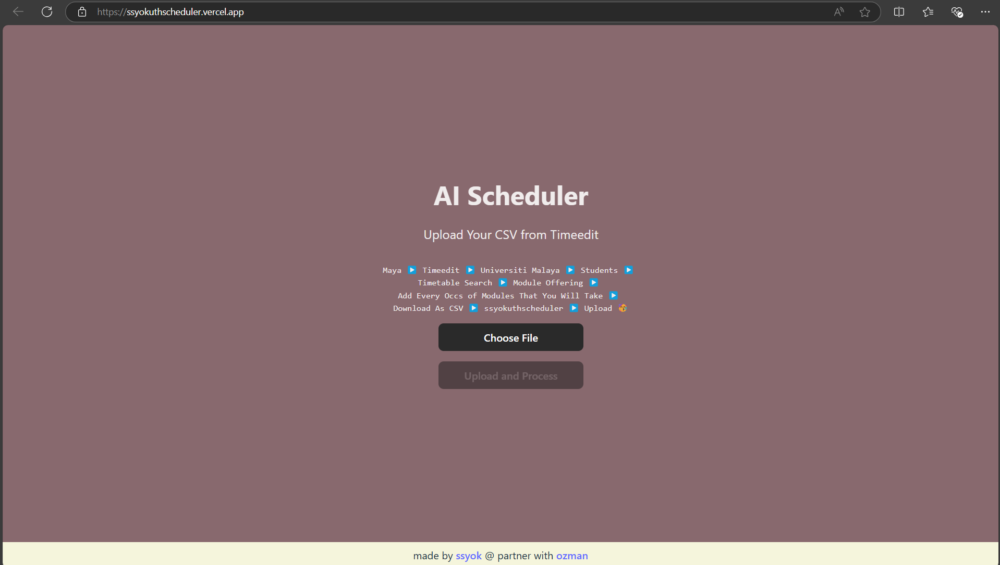

# AI Scheduler

AI Scheduler is a web application built with Vite, React, and TypeScript to help users manage their schedules efficiently.



## Steps to use it

1. Get the CSV file from Timeedit

<!-- <video width="640" height="360" controls>
  <source src="public/first step.mp4" type="video/mp4">
  Your browser does not support the video tag.
</video> -->

2. Use the ssyokuthscheduler

<!-- <video width="640" height="360" controls>
  <source src="public/AI Scheduler Step.mp4" type="video/mp4">
  Your browser does not support the video tag.
</video> -->


## Online Demo

You can access the live version of the application at:
[https://ssyokuthscheduler.vercel.app](https://ssyokuthscheduler.vercel.app)

## Framework

This project is built using:


<div style="display: inline-block; background-color: beige; padding: 5px 10px; border-radius: 5px; height: 28px; line-height: 28px;">
  <a href="https://www.jamaibase.com/" target="_blank">
  
  </a>
</div>

## Local Development

To run this project locally, follow these steps:

1. Clone the repository:
```
git clone https://github.com/szeyu/aischeduler.git
```

2. Navigate to the project directory:
```
cd aischeduler
```

3. Install dependencies:
```
npm i
```

4. Jamai Base setup:
- Go to https://cloud.jamaibase.com/
- Sign up for an account
- Go to project
- Click "New Project"
- Name it `scheduler`
- Once the project is created, click on it
- Inside the project, click the "Action Table" tab and create a new action table
- Name it `aischeduler`
  - Input column: `timeslot`
  - Output columns: `lunch_time`, `wake_up_late`, `extended_weekend`, `work_life_balance`
- For each output column, use the following prompt template:
  ```
  Table name: "aischeduler"

  timeslot: ${timeslot}

  Based on timeslot, choose only 1 timeslot from the timeslot where the user will enjoy the benefit of more <OUTPUT COLUMN NAME>.

  Output format:
  <integer>

  Remember to act as a cell in a spreadsheet and provide concise, relevant information without explanations unless specifically requested.
  ```
  (Replace <OUTPUT COLUMN NAME> with the appropriate column name)

- Create another new action table named `aischeduler_explanation`
  - Input columns: `combination` and `type_of_advantage`
  - Output column: `explanation`
- For the explanation output column, use the following prompt:
  ```
  Table name: "aischeduler_explanation"

  combination: ${combination}

  type_of_advantage: ${type_of_advantage}

  Based on the arrangement of time slots in the combination above, explain in detail why this schedule provides the specified type of advantage or benefit to the student.

  Your explanation should include:

  Specific time patterns or gaps in the schedule that contribute to this advantage
  How this arrangement impacts daily routines and overall student life
  Potential academic benefits or challenges associated with this schedule

  Provide a comprehensive, well-structured explanation that a student can easily understand and apply to their decision-making process. Use concrete examples where appropriate to illustrate your points.

  Remember to maintain a positive, encouraging tone while also being realistic about the implications of this schedule.

  Remember to act as a cell in a spreadsheet and provide concise, relevant information without explanations unless specifically requested.
  ```


5. Create a `.env` file and create the environment variable for API key as well as the Project ID
```
VITE_JAMAI_API_KEY=
VITE_JAMAI_PROJECT_ID=
```

6. Start the development server:
```
npm run dev
```

7. Open your browser and go to `http://localhost:5173`

## Contributing

We welcome contributions from everyone! Please refer to the [CONTRIBUTING.md](CONTRIBUTING.md) file for more information on how to get started.

## License

This project is licensed under the GNU Affero General Public License v3.0 (AGPL-3.0). 

You are free to:
- Fork this repository.
- Modify and distribute the code.
- Use the code for commercial purposes.

Under the following conditions:
- You must disclose the source code of your modified version.
- You must license your modifications under the same license (AGPL-3.0).
- If you use this code in a network service, you must make the complete source code available to users of that service.

For more details, see the [LICENSE](LICENSE) file in this repository.

Contributions to this project are welcome and will be governed by the same license.

## Contact

* [Sze Yu Sim](https://linkedin.com/in/szeyusim)
* [Uthman](https://linkedin.com/in/muhammed-usman-224188134)
